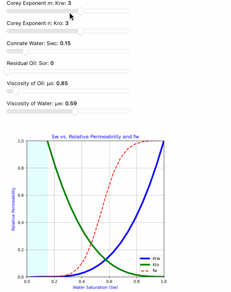

# Panel-used-to-Create-Relative-Permeability-Curves-using-the-Corey-Technique
The Corey relative permeability technique is a widely used empirical approach to model the relative permeability curves of two-phase flow in porous media. 

The Corey relative permeability technique, also known as Corey-Brooks or Corey-Krümmelbein method, is a widely used empirical approach to model the relative permeability curves of two-phase flow in porous media, typically for oil-water or gas-water systems. Developed by L.C. Corey in 1954, this technique provides a simple and practical way to estimate the relative permeabilities of oil and water (or gas and water) at different fluid saturations. The method is particularly valuable when direct measurements of relative permeability are not available or are challenging to obtain.

in this example we are using python’s Panel widgets to set the Corey Exponents (Corey_m and Corey_n), Connate Water (Swc) and Residual Oil (Sor), Viscosity of Oil (μo) and Viscosity of Water (μw) to construct our Relative Permeability and Fractional Flow Curves.

>
>
>
